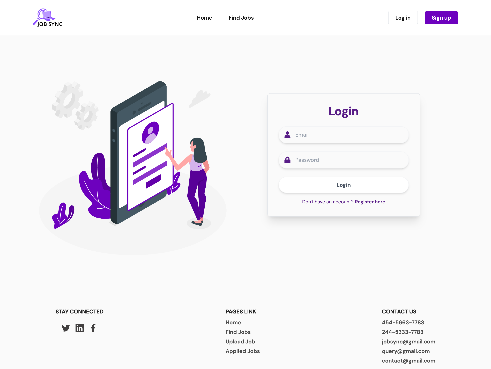
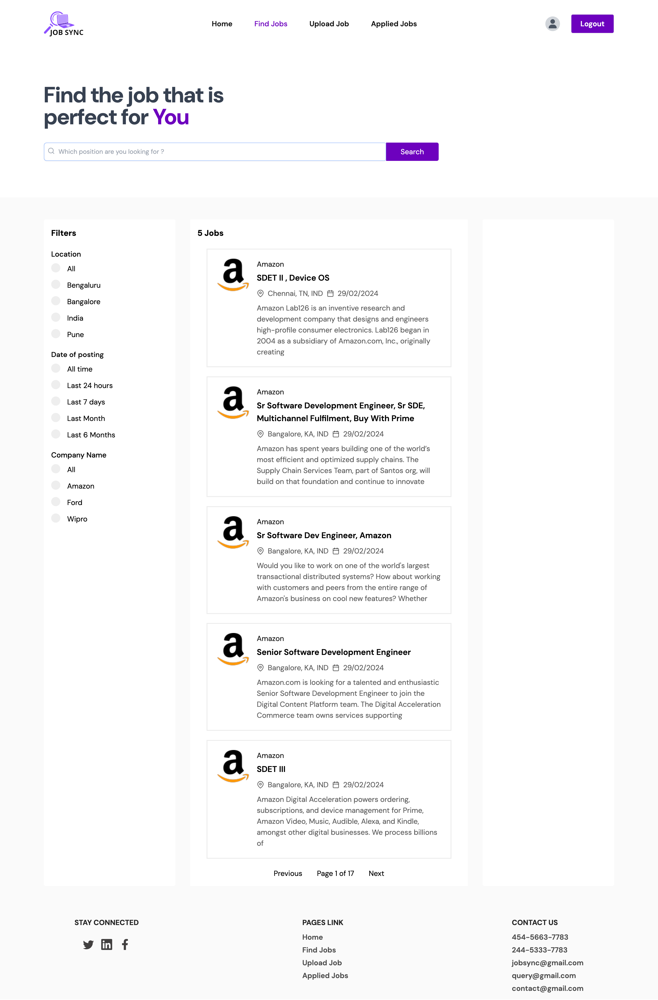
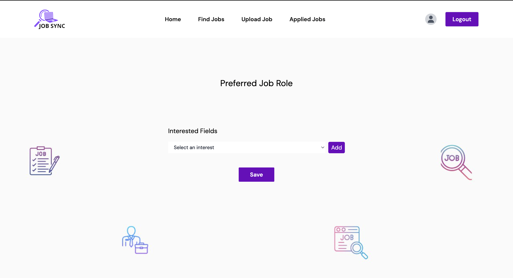
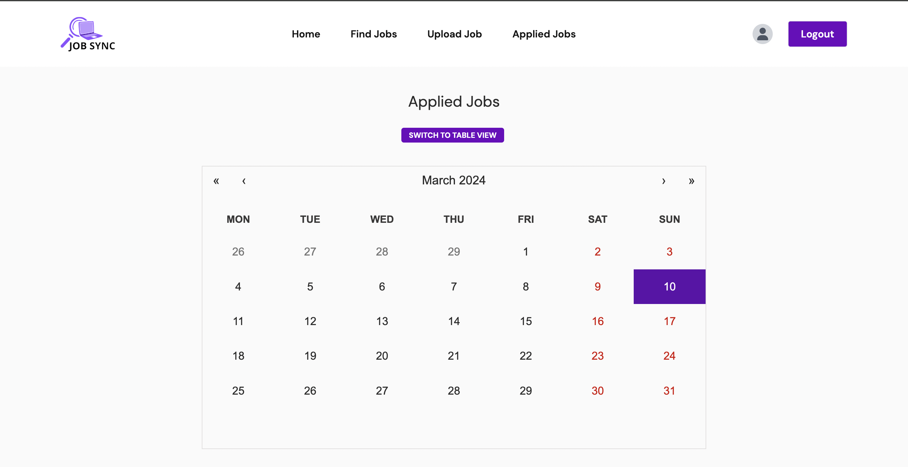

# JobSync: IT Job Portal

## Website Link: https://job-sync-sigma.vercel.app/
## Overview

The advent of technology has revolutionized the way job seekers connect, particularly in the Information Technology (IT) sector. This project aims to design and develop an innovative online job portal tailored specifically for the IT industry. JobSync offers a user-friendly interface for job seekers, incorporating advanced features to streamline the recruitment process. Job seekers can create profiles, specify their job preferences, and search for relevant job openings based on their roles and preferences. The portal integrates features such as email notifications, advanced search filters, and personalized recommendations to enhance user experience.

By leveraging the power of technology, JobSync aims to bridge the gap between talent and opportunity in the IT industry, ultimately facilitating smoother recruitment processes and fostering career advancement for professionals in this dynamic field.

## Project Structure

- `data/`: Contains datasets and job listings.
- `notebooks/`: Jupyter notebooks for data analysis and model training.
- `scripts/`: Python scripts for web scraping and data processing.
- `src/`: Source code for the web application.
- `tests/`: Unit tests and integration tests.
- `README.md`: Project overview and instructions.
- `LICENSE.md`: Project license.


## Installation

To run the JobSync platform locally, you need to have Node.js and MongoDB installed along with the following dependencies:

- React
- Node.js
- Express
- Mongoose

# Project Details
## Objective
The objective of the JobSync project is to develop an advanced online platform that seamlessly connects IT professionals with relevant job opportunities. The platform aims to efficiently match job seekers with positions that align with their skills, qualifications, and career goals.

## Proposed System
JobSync provides a user-friendly interface designed to ensure ease of navigation for job seekers, fostering engagement and interaction. Key features include:

- Profile Creation: Job seekers can create comprehensive profiles showcasing their expertise.
- Email Notifications: Keeps users informed about job interview dates and new job postings.
- Calendar Integration: Users can manage interviews, application deadlines, and other important events.
- Advanced Search Filters: Users can filter job listings based on location, date, specialization, etc.
- Personalized Recommendations: Leverages sophisticated algorithms to deliver tailored job suggestions.
- Scraper Integration: Utilizes web scraping technology to gather job postings from various sources across the internet.

## Features
- Location-Based Filtering: Users can filter job listings based on their preferred location, allowing them to find opportunities in specific cities, regions, or countries.
- Date Filtering: Job seekers can filter job postings based on the date they were posted, ensuring they view the most recent opportunities first.
- Specialization Filtering: Users can filter job listings based on specialization or specific skills required for the position, allowing them to find opportunities that match their expertise.
- Scrapper Integration: The system utilizes web scraping technology to gather job postings from various sources across the internet, ensuring a comprehensive database of available opportunities.
- Email Notifications: Users can opt-in to receive email notifications for new job postings that match their preferences, keeping them informed about relevant opportunities as soon as they become available.
- Calendar Integration: Users can sync their job search activities with their calendar, allowing them to manage interviews, application deadlines, and other important events efficiently.
- Preference Selection: Job seekers have the option to customize their preferences, such as industry, salary range, etc., ensuring they receive personalized job recommendations.

## Software Requirements
- Operating System: Windows 11, Linux, Mac OS
- Languages: HTML5, CSS3, React JS, Node JS
- Web Browser: Chrome, Mozilla, Internet Explorer
- Web Server: React
- IDE: Visual Studio Code
- Scripting Language: JavaScript (ES2015)
- Database: MongoDB

## Screenshots






You can install the required libraries using npm:

```bash
npm install
